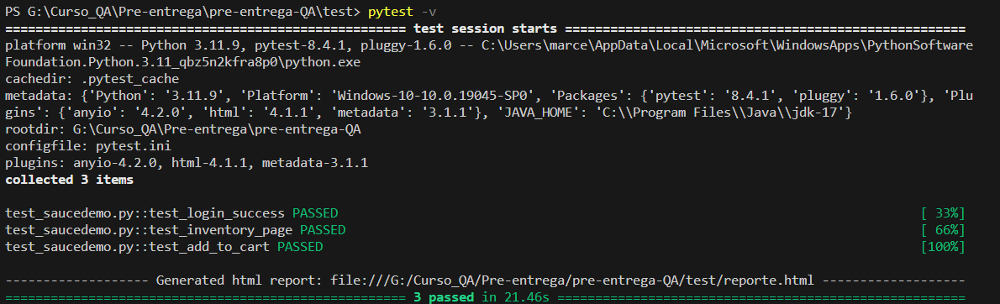

# 🧪 Pre-entrega: Automatización con Selenium + Pytest

Este proyecto demuestra la automatización de pruebas funcionales básicas sobre el sitio [**saucedemo.com**](https://www.saucedemo.com/) utilizando **Selenium WebDriver**, **Pytest** y **ChromeDriverManager**.  
El objetivo es simular la experiencia real de un usuario y validar que las principales funcionalidades del sitio respondan correctamente.

---

## 🚀 Objetivo del Proyecto
Automatizar y validar las siguientes acciones clave:

- ✅ **Login:** ingreso con credenciales válidas e inválidas.  
- 🧭 **Navegación:** acceso y recorrido por la página de inventario.  
- 🛒 **Carrito de compras:** agregar productos al carrito de compras.

---

## 🧰 Tecnologías Utilizadas
- 🐍 **Python 3.x**  
- 🌐 **Selenium WebDriver**  
- ⚙️ **Pytest**  
- 📦 **Webdriver Manager**  
- 🧾 **Pytest-HTML** (para reportes detallados de ejecución)

---
## 🖼️ Testeo de la aplicación

